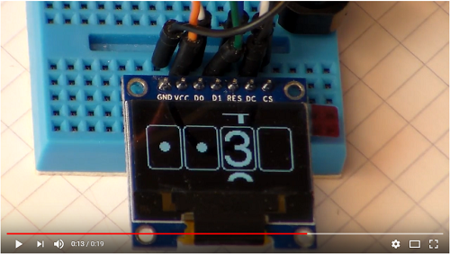
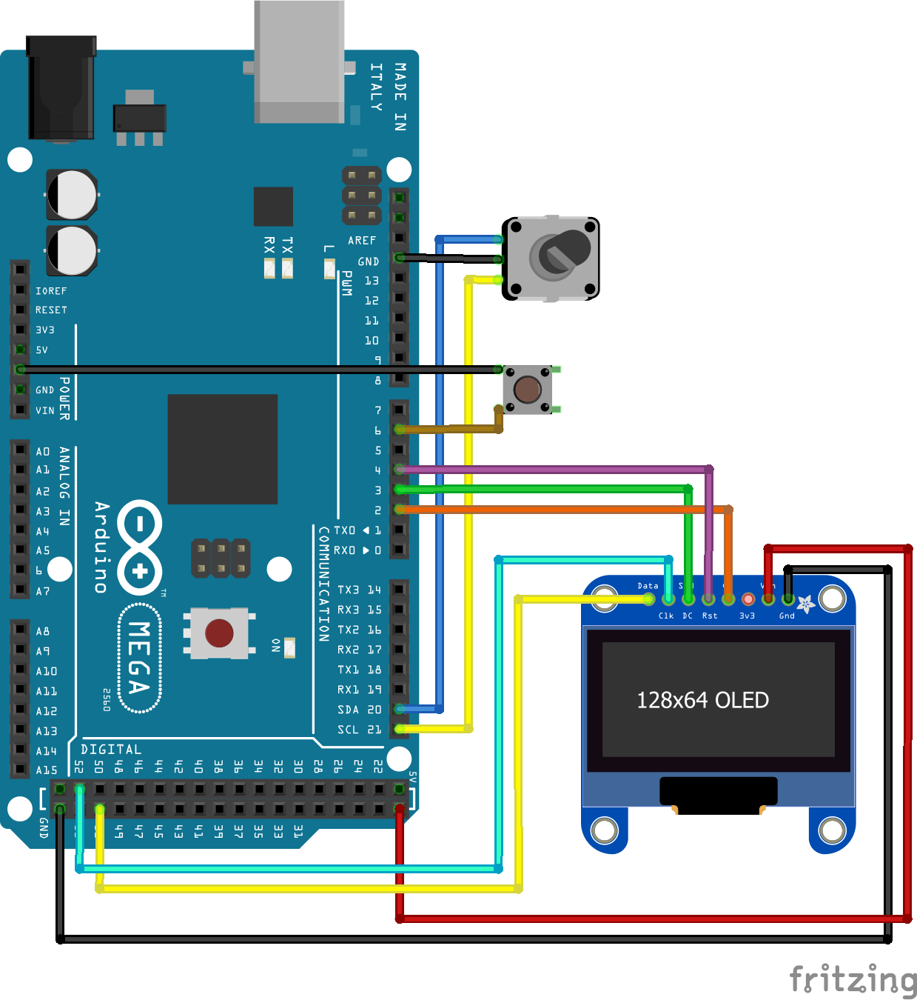

Pincode library for rotary encoders
=======

[](https://youtu.be/sDqXEvIP3ns)


This Arduino library provides a way to ask a user for a 4-digit pincode on a SSD1306 128x64 px SPI Display. The code is entered by turning a rotary encoder. The start point of each digit is randomised, so that there is an additional layer of security e.g. no one can extrapolate the pin by observing the movements of the encoder.

The library uses the [Adafruit library for SSD1306 displays](https://github.com/adafruit/Adafruit_SSD1306) and the [Encoder library of Paul Stoffregen](https://github.com/PaulStoffregen/Encoder).

The library also supports SHA256 hashing through the [crypto library from Southern Storm Software]( https://github.com/rweather/arduinolibs/tree/master/libraries/Crypto), so that the pin is not stored in plaintext.

For now it only supports a 128x64 pixel [SSD1306 OLED display](https://learn.adafruit.com/monochrome-oled-breakouts/arduino-library-and-examples) over SPI.

A minimal plaintext variant uses approximately 24.500 bytes of flash, so there is not much room for your own code if you use an ATMEGA32 based Arduino e.g. Arduino Uno.

## Usage

```c++
#include <Pincode.h>
#include <Adafruit_SSD1306.h>
#include <Encoder.h>

#define OLED_DC     3
#define OLED_CS     2
#define OLED_RESET  4

#define BUTTON      6
#define ENCODER_1   20
#define ENCODER_2   21

Adafruit_SSD1306 display(OLED_DC, OLED_RESET, OLED_CS);
Encoder myEnc(ENCODER_1, ENCODER_2);
Pincode pincode(&display, &myEnc, BUTTON);

byte pin[] = {1, 2, 3, 4};

void setup() {
  display.begin(SSD1306_SWITCHCAPVCC);
  pinMode(BUTTON, INPUT_PULLUP);
}

void loop() {
  byte inputPin[4];
  boolean ok = true;

  // (Optional) A floating A0 as input for the RNG
  pincode.setRandomSeed(analogRead(A0));

  //
  pincode.reqPin(inputPin);

  // Check if pins match
  for (int i = 0; i < 4; i++) {
    if (inputPin[i] != pin[i]) {
      ok = false;
      break;
    }
  }

  // Print "OK" if the pin is correct or "NO" otherwise
  display.clearDisplay();
  display.setCursor(0, 40);

  if (ok) {
    display.print("OK");
  } else {
    display.print("NO");
  }
  display.display();

  delay(1000);
}
```



## TODO

* Support for other display sizes and types
* Possibility to deactivate animation, which probably only works with SPI and not IIC
* Encryption of the pin
